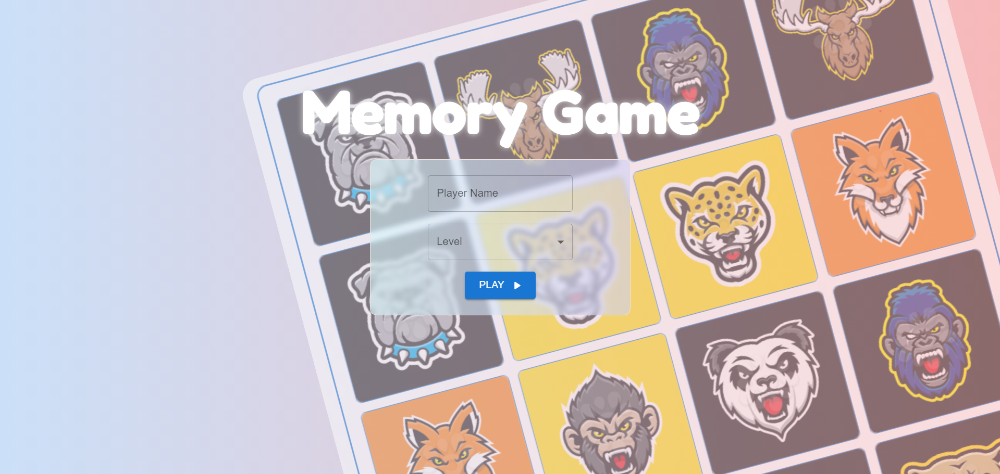
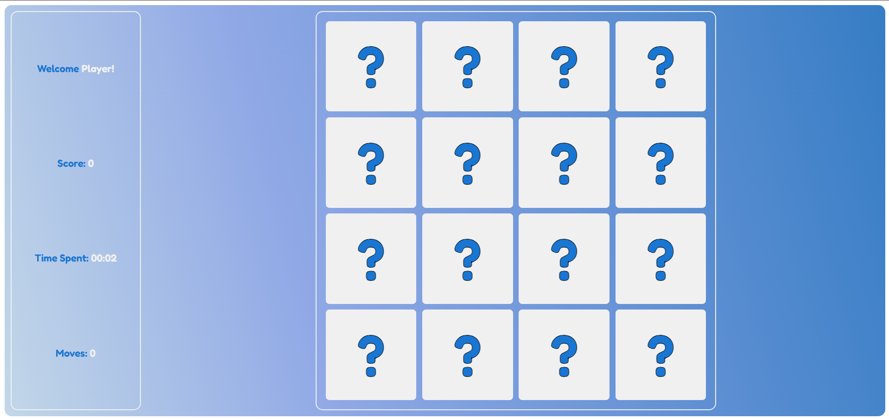
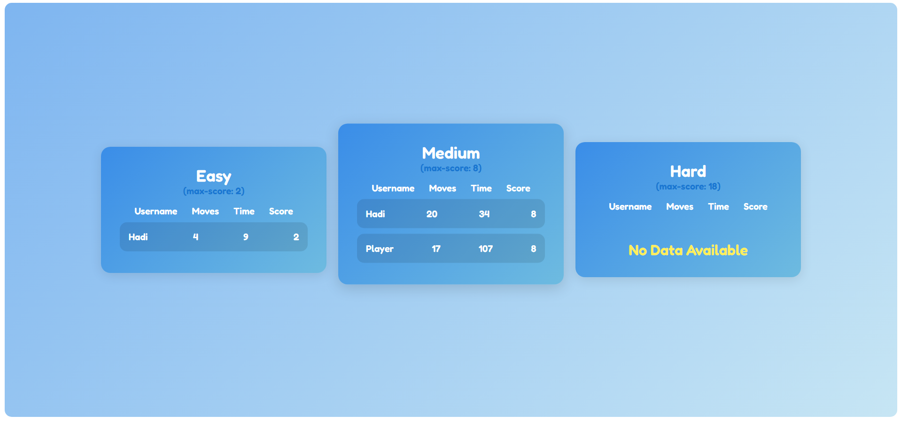

# Memory Card Game 🃏

A fun and interactive memory card game built with React, TypeScript, and Material-UI. Test your memory by matching pairs of cards while tracking your score, time, and attempts!

## Features ✨

- **Card Matching**: Flip cards to find matching pairs.
- **Levels**: Multiple difficulty levels (Easy, Medium, Hard).
- **Timer**: Track elapsed time in `MM:SS` format.
- **Score System**: Earn points for correct matches.
- **User Authentication**: Save player names and scores.
- **Scoreboard**: View top scores and player stats.

## Technologies Used 🛠️

- **React** + **TypeScript**: Frontend framework with type safety.
- **Material-UI (MUI)**: Styled components and responsive design.
- **Context API**: Global state management for user data and game state.
- **useReducer**: Complex state logic for card interactions and timers.
- **React Router**: Navigation between game and scoreboard pages.
